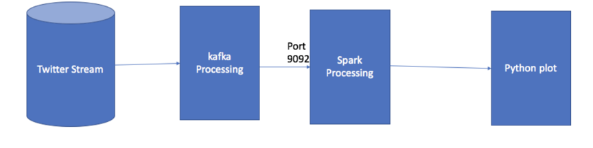

# Twitter Application

## Group member:
- Yuepei Li,
- Jingqiao Xu,
- Jieyun hu   						

## Brief description:

We create a twitter application,
using distributed system like spark, kafka to deal with real-time data, and using flask to visualize popular twitter hashtags. The pipeline is like the following, which includes listening port by using socket and distributed system like spark.

## Project Summary:
* Implemented a real-time processor with Spark for popular Twitter hashtags
* Designed and implemented positive/negative word monitor with Kafka and Spark (60 Tweets per second)
* Visualized the results with Ajax and Javascript chart for 1% of all public Tweets
